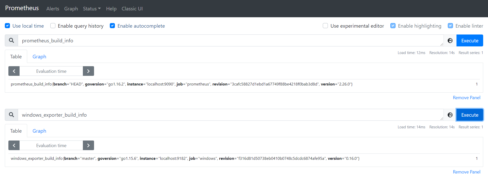

# OpenteLemetry和Prometheus的remote-write-receiver的实验

## 1. 实验环境

| 序号 | 名称             | 说明                  |
| ---- | ---------------- | --------------------- |
| 1    | 操作系统         | windows 10            |
| 2    | prometheus       | 版本v2.26.0           |
| 3    | otel_collector   | OpenteLemetry的收集器 |
| 4    | windows_exporter | windows系统的采集器   |

## 2. 实验过程

### 2.1. 启动`prometheus`

修改Prometheus的配置文件, 增加抓取任务`windows`以抓取本机指标，其他保持默认：

```yaml
# my global config
global:
  scrape_interval:     15s # Set the scrape interval to every 15 seconds. Default is every 1 minute.
  evaluation_interval: 15s # Evaluate rules every 15 seconds. The default is every 1 minute.
  # scrape_timeout is set to the global default (10s).

# Alertmanager configuration
alerting:
  alertmanagers:
  - static_configs:
    - targets:
      # - alertmanager:9093

# Load rules once and periodically evaluate them according to the global 'evaluation_interval'.
rule_files:
  # - "first_rules.yml"
  # - "second_rules.yml"

# A scrape configuration containing exactly one endpoint to scrape:
# Here it's Prometheus itself.
scrape_configs:
  # The job name is added as a label `job=<job_name>` to any timeseries scraped from this config.
  - job_name: 'prometheus'

    # metrics_path defaults to '/metrics'
    # scheme defaults to 'http'.

    static_configs:
    - targets: ['localhost:9090']
  - job_name: 'windows'
    static_configs:
    - targets: ['localhost:9182']

```

```sh
cd /d/tools/otel/prometheus-2.26.0.windows-amd64
./prometheus.exe --web.listen-address="127.0.0.1:9090"  --enable-feature="remote-write-receiver"
```

### 2.2. 启动`windows_exporter`

```sh
cd /d/tools/otel/windows_exporter
./windows_exporter-0.16.0-amd64.exe --telemetry.addr="127.0.0.1:9182"
```

### 2.3. 启动`otelcol`

`otelcol`的配置文件:

注：来源自[opentelemetry-collector/examples/demo/otel-collector-config.yaml](https://github.com/open-telemetry/opentelemetry-collector/blob/main/examples/demo/otel-collector-config.yaml), 并修改以支持Prometheus的远程写。

```yaml
receivers:
  otlp:
    protocols:
      grpc:
      http:

exporters:
  prometheusremotewrite:
    external_labels:
      label1: value1
      namespace: "test_remote_write"
    endpoint: "http://127.0.0.1:9090/api/v1/write"
  logging:

processors:
  batch:

extensions:
  health_check:
  pprof:
    endpoint: :1888
  zpages:
    endpoint: :55679

service:
  extensions: [pprof, zpages, health_check]
  pipelines:
    metrics:
      receivers: [otlp]
      processors: [batch]
      exporters: [logging, prometheusremotewrite]

```

```sh
cd /d/tools/otel/otel
./otelcol_windows_amd64.exe --config collect_config.yaml
```

### 2.3. 启动指标生成命令

源码：[demo](./demo)

注：来源自[opentelemetry-collector/examples/demo/app](https://github.com/open-telemetry/opentelemetry-collector/blob/main/examples/demo/app), 并修改只保留了指标导出。

```sh
cd /d/tools/otel/demo
go run main
```

## 3. 实验结果

### 3.1. Prometheus的抓取目标


### 3.2. 采集器面板



### 3.3. otel主动写入的指标


## 4. 实验结果

Prometheus的新版本支持了内置的远程写入，数据格式和以前的`remote_write`写入远程存储一样;
Opentelemetry的collector支持Prometheus的远程写，因此我们可以利用otel主动推送指标，同时利用Prometheus的可视化等功能。
